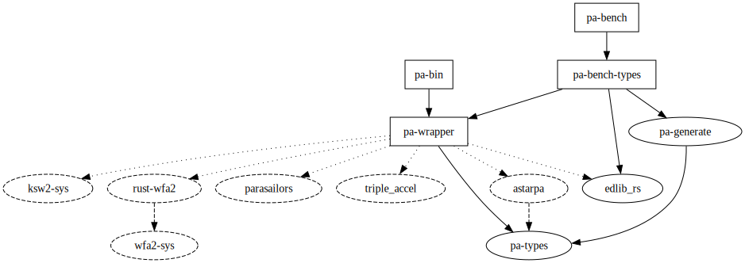

# Pairwise Alignment Benchmarks

This repository contains a few things:

- [`pa-wrapper`](#pa-wrapper-wrapper-api): a wrapper library around pairwise aligners;
- [`pa-bin`](#pa-bin-unified-binary): a unified command line tool to call these aligners;
- [`pa-bench`](#pa-bench-benchmarking): a tool to benchmark aligners against each other;
- [`evals/astarpa`](./evals/astarpa): experiments and analysis for the
  [A\*PA](https://github.com/ragnargrootkoerkamp/astar-pairwise-aligner) paper.
- [`evals/astarpa-next`](./evals/astarpa-next): the latest experiments and results.

## `pa-wrapper`: Wrapper API

`pa-wrapper` contains a unified API to a number of aligners:

A\*PA, Block Aligner, Edlib, Ksw2, Parasail, Triple Accel, [Bi]Wfa

Create an [`AlignerParams`](./pa-wrapper/src/lib.rs) object and call
`build_aligner()` on it to obtain an instance of an aligner, on which `.align()`
can be called repeatedly.

<details><summary>Adding an aligner</summary>
To add an aligner, update `pa-wrapper/Cargo.toml` and `pa-wrapper/src/lib.rs`,
and add a new file `pa-wrapper/src/wrappers/<name>.rs`. Remember to crash the program for unsupported parameter
configurations!

</details>

## `pa-bin`: Unified binary

Use `cargo run --bin pa-bin -- <arguments> input/file/or/dir.{txt,seq,fa}` to run any of the supported aligners
on some input.

<details><summary>Succinct help of pa-bin (see --help for more):</summary>

```text
CLI tool that wraps other aligners and runs them on the given input

Usage: pa-bin [OPTIONS] <--aligner <ALIGNER>|--params <PARAMS>|--params-file <PATH>|--print-params <ALIGNER>> [INPUT] [OUTPUT]

Arguments:
  [INPUT]   (Directory of) .seq, .txt, or Fasta files with sequence pairs to align
  [OUTPUT]  Write a .csv of `{cost},{cigar}` lines. Defaults to input file with .csv extension

Options:
      --cost-only  Return only cost (no traceback)
      --silent     Do not print anything to stderr
  -h, --help       Print help (see more with '--help')

Aligner:
      --aligner <ALIGNER>       The aligner to use with default parameters [possible values: astar-nw, astar-pa,
                                block-aligner, edlib, ksw2, triple-accel, wfa]
      --params <PARAMS>         A specific aligner with parameters
      --params-file <PATH>      File with aligner parameters
      --print-params <ALIGNER>  Print default parameters for the given aligner [possible values: astar-nw, astar-pa,
                                block-aligner, edlib, ksw2, triple-accel, wfa]
      --json                    The parameters are json instead of yaml

Cost model:
      --sub <COST>     Substitution cost, (> 0) [default: 1]
      --open <COST>    Gap open cost (>= 0) [default: 0]
      --extend <COST>  Gap extend cost (> 0) [default: 1]
```

</details>

The aligner to run can be specified with `--aligner <ALIGNER>` for default
arguments, or `--params[-file]` to read a (yaml or json) string of parameters
(from a file). Use `--print-params <ALIGNER>` to get default parameters that can
be modified.

## `pa-bench`: Benchmarking

For benchmarking, see [input format](#input-format), [usage](#usage), and [quick start](#quick-start) below.

Benchmarking is done using `job`s. Each job consists on an input dataset (a
`.seq` file), a cost model, and a tool with parameters.
The `pa-bench` binary calls itself (recursively) for each job to measure time
and memory usage.
An _experiment_ consists of a `yaml` [input configuration file](#input-format) is used to specify the list
of jobs to run.

Results are incrementally accumulated in a `json` _results_ file.

### Quick start

The easiest way to get started is probably to first clone (and fork) the repository.
Then, you can copy either:

- The `evals/astarpa` directory with all experiments (`*.yaml`) and
  analysis/plots (`evals.ipynb`) used in the A\*PA paper.
- The `evals/astarpa-next` directory that specifically tests new versions of
  A\*PA on some datasets of ultra long ONT reads of human data. This contains the
  code to plot boxplots+swarmplots of the distribution of runtimes on a dataset.
- Or you can modify/add experiments to `evals/experiments/` and use `evals/evals.ipynb`.

If you think your experiments, analysis, and/or plots are generally useful and
interesting, feel free to make a PR to add them here.

### Benchmarking features

**Main settings**

- **Time limit**: Use `--time-limit 1h` to limit each run to `1` hour using `ulimit`.
- **Memory**: Use `--mem-limit GiB` to limit each run to `1GiB` of total memory using `ulimit`.
- **Nice**: Use `--nice=-20` to increase the priority of each runner job. This
  requires root. (See the end of this file.)
- **Parallel running**: Use `-j 10` to run `10` jobs in parallel. Each job is **pinned** to a different core.
- **Pinning**: By default, each job is fixed to run on a single core. This
  doesn't work on all OSes and can crash/`Panic` the runner. Use `--no-pin` to
  avoid this.
- **Incremental running**: By default, jobs results already present
  in the target `json` file are reused. With `--rerun-failed`, failed jobs are
  retried, and with `--rerun-all`, all jobs are rerun. `--clean` completely
  removes the cache.

**Debugging failing jobs**

- To see which jobs are being run, use `--verbose`.
- To see the error output of runners, use `--stderr`. This should be the first
  thing to do to figure out why jobs are failing.

**Output**

Output is written to a `json` file, and also written to a cache that can be
reused across experiments.

- **Runtime** of processing input pairs, excluding startup and file io time.
- **Maximum memory usage** (max rss), excluding the memory usage of the input data.
- **Start and end time** of job, for logging purposes.
- **CPU frequency** at start and end of job, as a sanity check.

**Other**

- **Skipping**: When a job fails, all _larger_ jobs (larger `n` or `e`) are
  automatically skipped.
- **Interrupting**: You can interrupt a run at any time with `ctrl-C`. This will stop ongoing
  jobs and write results so far to disk.
- **Cigar checking**: When traceback is enabled, all Cigar strings are checked
  to see whether they are valid and have the right cost.
- **Cost checking**: The cost returned by exact aligners is cross-validated. For
  inexact aligners, the fraction of correct results is computed.

### Input format

The input is specified as a `yaml` file containing:

- **datasets**: file paths or settings to generate datasets;
- **traces**: whether each tool computes a path or only the edit distance;
- **costs**: the cost models to run all aligners on;
- **algos**: the algorithms (aligners with parameters) to use.

A job is created for the each combination of the 4 lists.

Examples can be found in [`evals/experiments/`](./evals/experiments). Here is one:

```yaml
datasets:
  # Hardcoded data
  - !Data
    - - CGCTGGCTGCTGCCACTAACTCCGTATAGTCTCACCAAGT
      - CGCTGGCTCGCCTGCCACGTAACTCCGTATAGTCTCACCAACTGTCAGTT
    - - AACCAGGGTACACCGACTAATCCACGCACAAGTTGGGGTC
      - ACAGGTACACCACTATCACGACAAGTTGGGTC
  # Path to a single .seq file, relative to `evals/data`
  - !File path/to/sequences.seq
  # Recursively finds all non-hidden .seq files in a directory, relative to `evals/data`
  - !Directory path/to/directory
  # Download and extract a zip file containing .seq files to `evals/data/download/{dir}`
  - !Download
    url: https://github.com/pairwise-alignment/pa-bench/releases/download/datasets/chm13.v1.1-ont-ul.500kbps.zip
    dir: human/chm13/
  # Generated data in `evals/data/generated/`
  - !Generated # Seed for the RNG.
    seed: 31415
    # The approximate total length of the input sequences.
    total_size: 100000
    # The error models to use. See pa-generate crate for more info:
    # https://github.com/pairwise-alignment/pa-generate
    error_models:
      # Uniform, NoisyInsert, NoisyDelete, NoisyMove, NoisyDuplicate, SymmetricRepeat
      - Uniform
    error_rates: [0.01, 0.05, 0.1, 0.1]
    lengths: [100, 1000, 10000, 100000]
# Run both with and without traces
traces: [false, true]
costs:
  # unit costs
  - { sub: 1, open: 0, extend: 1 }
  # affine costs
  - { sub: 1, open: 1, extend: 1 }
algos:
  - !BlockAligner
    size: !Size [32, 8192]
  - !ParasailStriped
  - !Edlib
  - !TripleAccel
  - !Wfa
    memory_model: !MemoryUltraLow
    heuristic: !None
  - !Ksw2
    method: !GlobalSuzukiSse
    band_doubling: false
  - !AstarPa
```

### Usage

1. Clone this repo and make sure you have Rust installed.
2. Run `cargo run --release -- [--release] evals/experiments/test.yaml` from the root.
3. In case of errors, add `--verbose` to see which jobs are being run, and/or
   `--stderr` to see the output of failing (`Result: Err(Panic)`) jobs. For
   non-linus OSes, you may need to add `--no-bin` to disable pinning to specific cores.

First, this will generate/download required input data files in `evals/data`.
Results are written to `evals/results/test.json` and a cache of all (outdated)
jobs for the current experiment is stored in `evals/results/test.cache.json` or
at the provided `--cache`.

<details><summary>Succinct help of pa-bench (see --help for more):</summary>

```text
Usage: pa-bench bench [OPTIONS] [EXPERIMENTS]...

Arguments:
  [EXPERIMENTS]...  Path to an experiment yaml file

Options:
  -o, --output <OUTPUT>  Path to the output json file. By default mirrors the `experiments` dir in `results`
      --cache <CACHE>    Shared cache of JobResults. Default: <experiment>.cache.json
      --no-cache         Completely disable using a cache
  -j <NUM_JOBS>          Number of parallel jobs to use [default: 5]
      --rerun-all        Ignore job cache, i.e. rerun jobs already present in the results file
      --rerun-failed     Rerun failed jobs that are otherwise reused
      --release          Shorthand for '-j1 --nice=-20'
  -h, --help             Print help (see more with '--help')

Limits:
  -t, --time-limit <TIME_LIMIT>  Time limit. Defaults to value in experiment yaml or 1m
  -m, --mem-limit <MEM_LIMIT>    Memory limit. Defaults to value in experiment yaml or 1GiB
      --nice <NICE>              Process niceness. '--nice=-20' for highest priority
      --no-pin                   Disable pinning, which may not work on OSX

Output:
  -v, --verbose  Print jobs started and finished
      --stderr   Show stderr of runner process
```

</details>

### Notes on benchmarking

**Niceness.**
Changing niceness to `-20` (the highest priority) requires running `pa-bench` as root. Alternatively, you could add the following line to
`/etc/security/limits.conf` to allow your user to use lower niceness values:

```text
<username> - nice -20
```

**Pinning.**
Pinning jobs to cores probably only works on linux. On other systems, benchmarking
will crash and will report `Result: Err(Panic)`. Use `--no-pin` to avoid this.

**CPU Settings.** Make sure to

- fix the cpu frequency using
  `cpupower frequency-set -d 2.6GHz -u 2.6GHz -g powersave` (`powersave` can
  give more consistent results than `performance`),
- disable hyperthreading,
- disable turbo-boost,
- disable power saving,
- the laptop is fully charged and connected to power.

### Datasets

Datasets are available in the [`datasets` release](https://github.com/pairwise-alignment/pa-bench/releases/tag/datasets).

## Code layout

<!-- cargo depgraph --features parasail --include pa-bin,pa-wrapper,pa-bench,triple_accel,ksw2-sys,pa-generate,astarpa,edlib_rs,pa-types,pa-bench-types,rust-wfa2,wfa2-sys,parasailors --dedup-transitive-deps | dot -Tsvg > imgs/depgraph-small.svg -->



From low-level to higher, the following crates are relevant:

- `pa-types`: Basic pairwise alignment types such as `Seq`, `Pos`, `Cost` and `Cigar`.
- `pa-generate`: A utility to generate sequence pairs with various kinds or error types.
- `pa-wrapper` contains an `AlignerTrait` and implements this uniform interface
  for all aligners. Each aligner is behind a feature flag. Parasailors is
  disabled by default do reduce the otherwise large build time.
- `pa-bin` is a thin binary/CLI around `pa-wrappers`.
- `pa-bench-types` contains the definition of a `Experiment`, `Dataset`, `Job`,
  `JobResult`, and the `AlgorithmParams` enum that selects the algorithm to run
  and its parameters. This causes `pa-bench-types` to have dependencies on
  crates that contain aligner-specific parameter types.
- `pa-bench` contains a binary that collects all jobs in an experiment
  and calls itself once per job.
